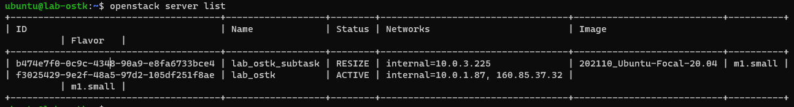

# Lab OSTK

## Task 1

> Creating an Instance with the CLI

```sh
openstack server create --flavor m1.small --image 202110_Ubuntu-Focal-20.04 --key-name lap_l13 --security-group  ccp1-lab --network internal lab_ostk_subtask
```


> Elasticity, Scale an Instance Vertically

If resize it to a different flavor then the instance gets rebuild and therefore restarted

```sh
openstack server resize --flavor m1.medium lab_ostk_subtask
```

If we do a resize of an instance then the status of it is set to `RESIZE`



If the process was successful then we've to `--confirm` the change:

```sh
openstack server resize --confirm lab_ostk_subtask
```

If something goes wrong in the process we can `--revert` the changes:

```sh
openstack server resize --revert lab_ostk_subtask
```
